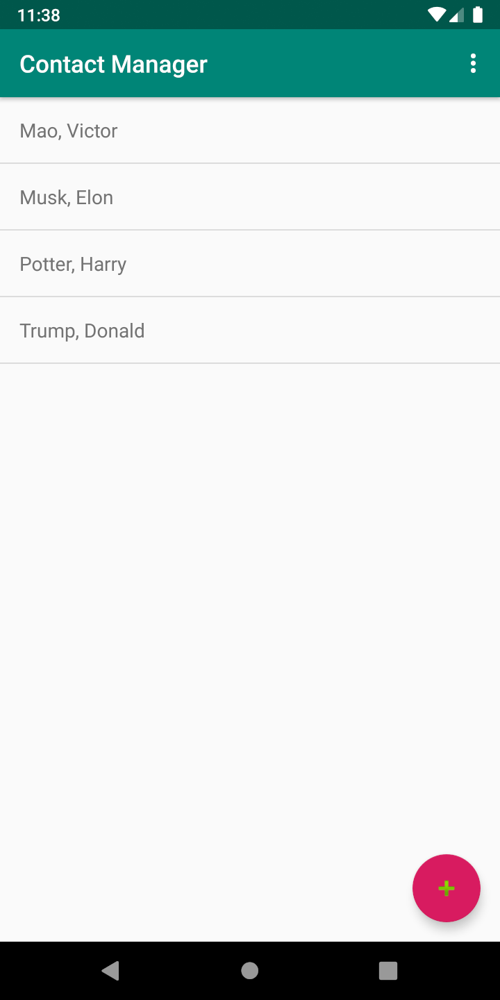
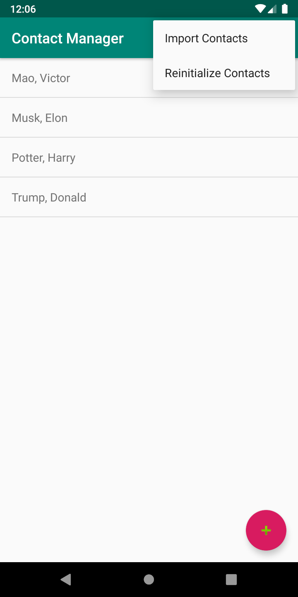
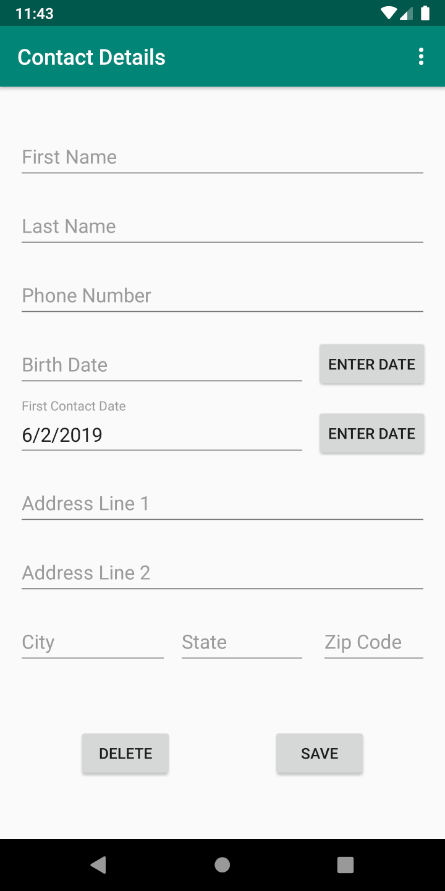
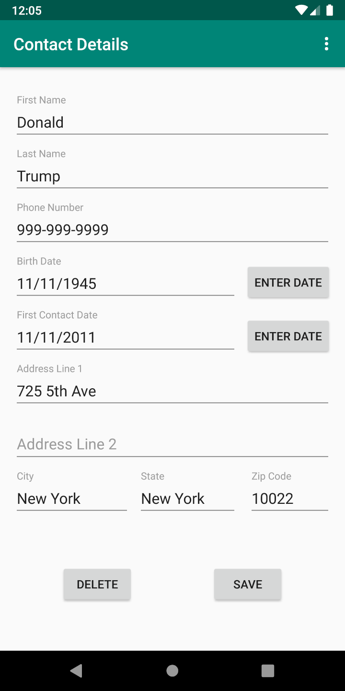
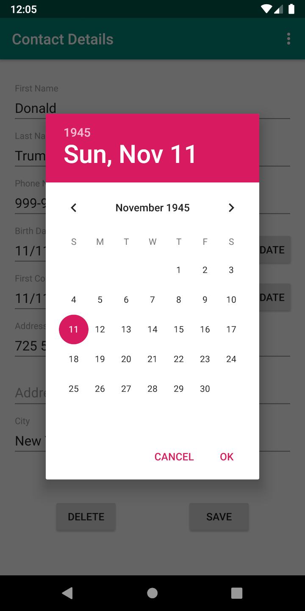
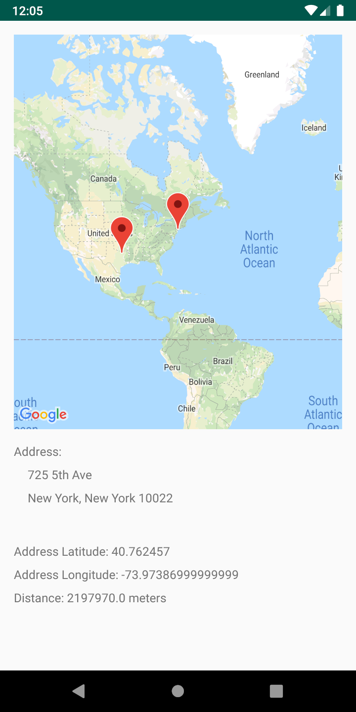

## Goal ##

Create an Android mobile application that manages contacts. This project was split into four phases.

## Phases ##

1. Design screen layout and simple I/O functionality using a text file as a database.
2. Use sensor detection to switch sort order of contact list.
3. Overhaul text file database and implement SQLite Database.
4. Add address fields and google map API reverse geocoding.

## Programming Languages ##

* Java
* Contact me via [email](mailto:me@victormao.com "me@victormao.com") if you are interested in the source code

## Software ##

* Android Studio
* Google Maps API

## Android App Concepts ##

* Views
* Activities
* Fragments
* File I/O
* ArrayList Adapters
* Sensors
* SQLite Database
* Google Maps
* Async Tasks
* JSON Parsing
* Current Location via Location Services

## Screenshots ##

