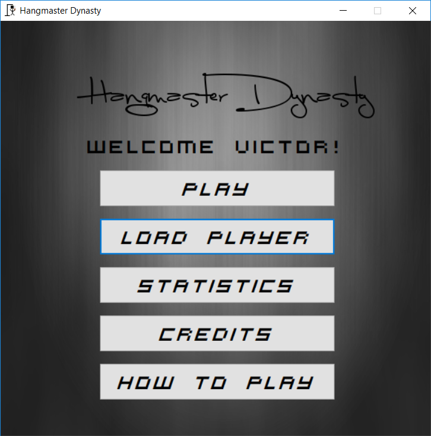
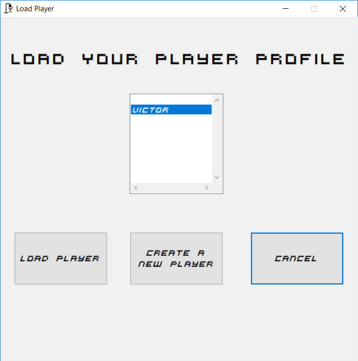
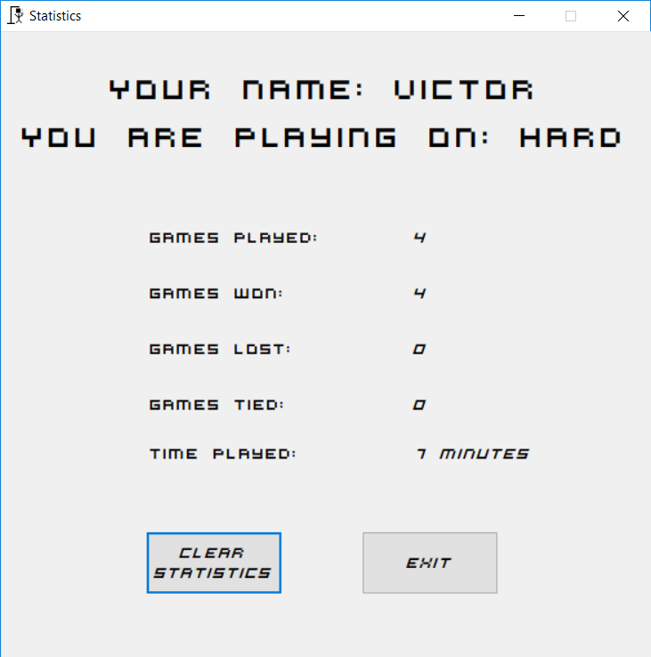
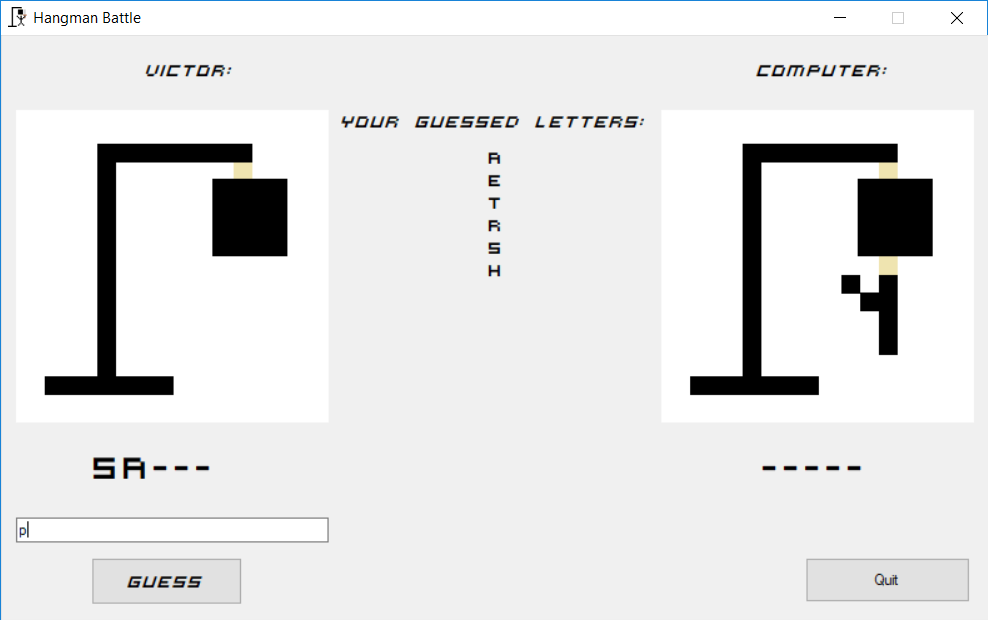
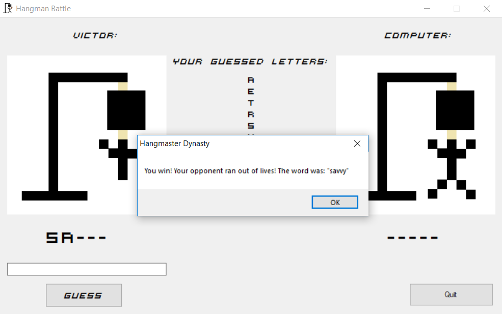

## Goal ##

This is a computer game version of the populat game Hangman created in **VB.NET** complete with Profile Loading, Statistics, and Music!

## Programming Languages ##

* VB.NET
* Contact me via [email](mailto:me@victormao.com) if you are interested in the source code

## Software ##

* Microsoft Visual Studio 2010
* GIMP 2
* Audacity

## Computer Science Concepts ##

* Arrays
* File Reading/Writing

## Screenshots ##

